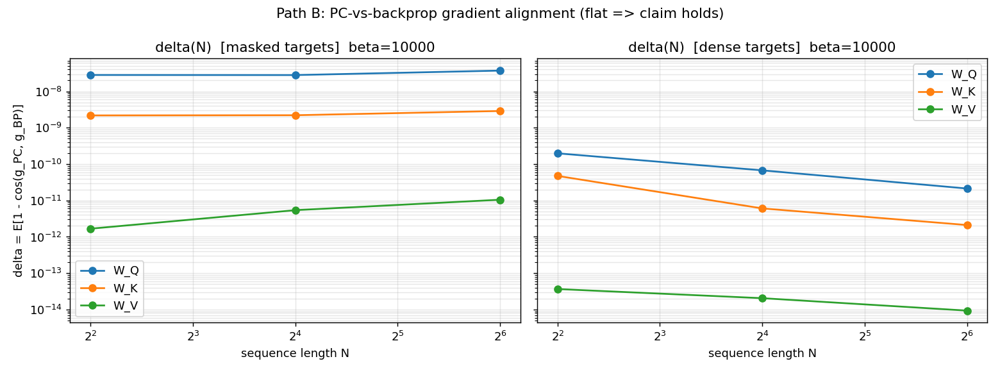
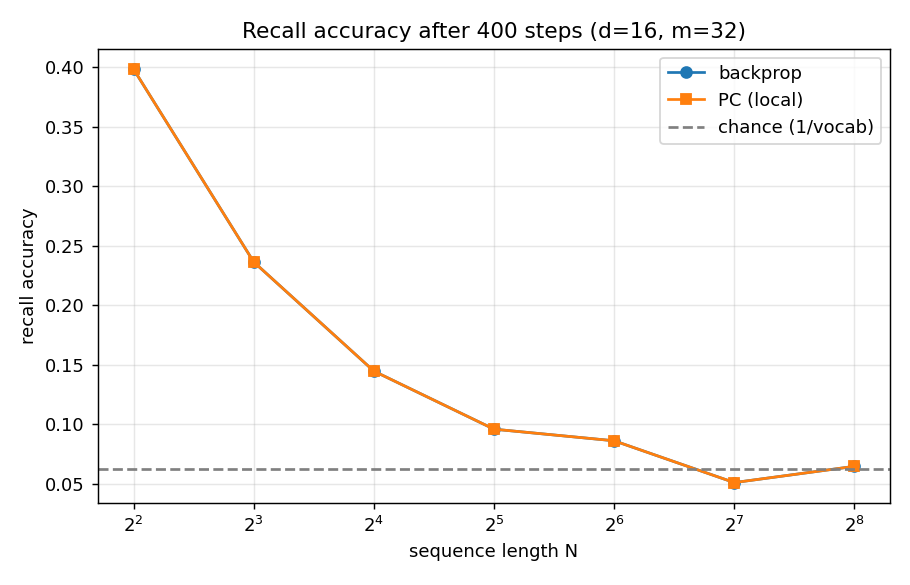
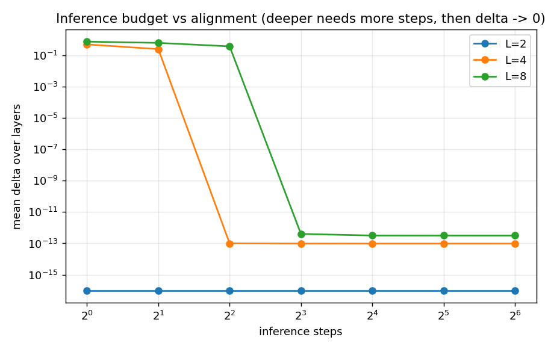
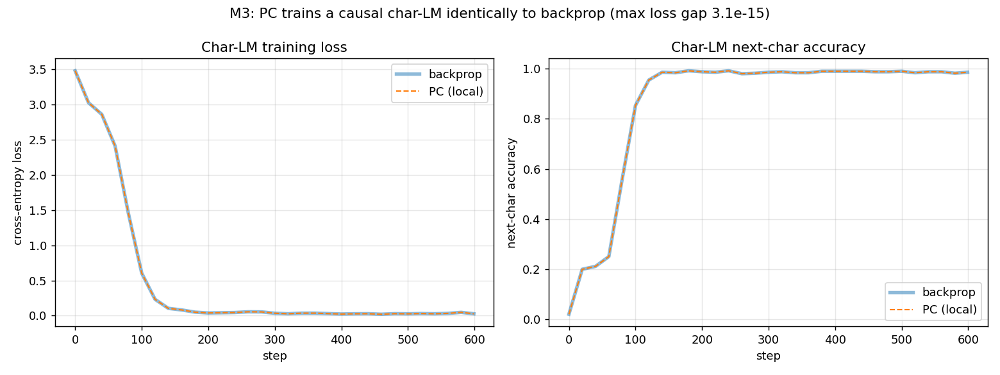
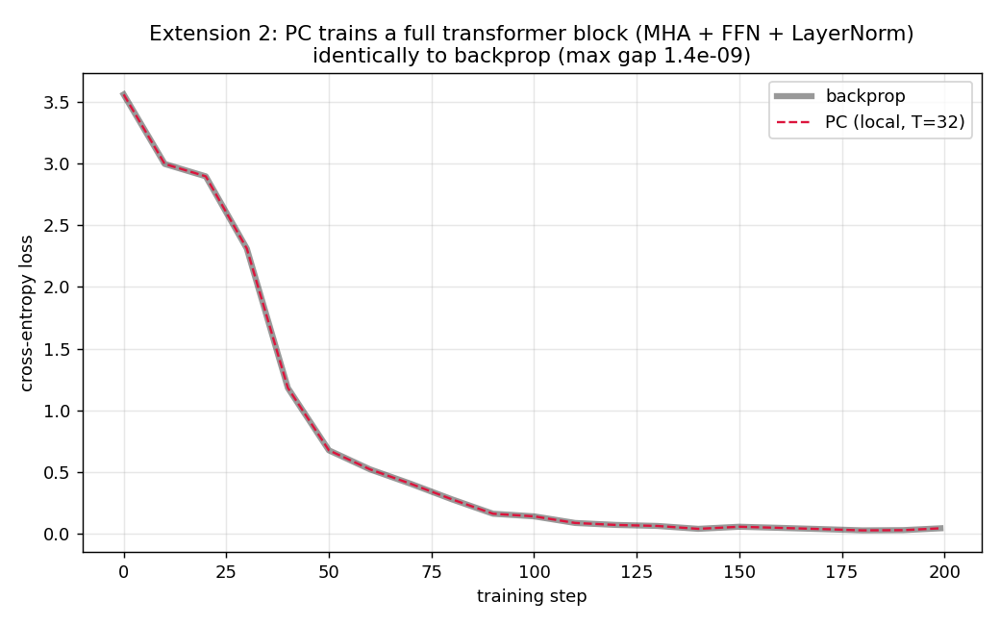
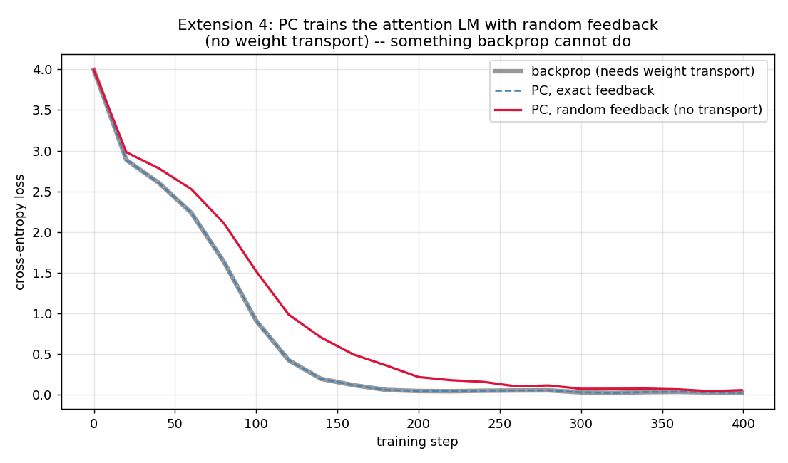

Claude 이용해서 보고서 작성함

# 뇌처럼 배우는 방식으로 트랜스포머를 학습시킬 수 있을까?
### — 비전공자를 위한 프로젝트 보고서 (초안)

> **세 줄 요약**
> 1. 오늘날 AI(챗봇 등)는 **역전파(backprop)** 라는 방법으로 배우는데, 이 방식은 뇌가 실제로 쓰기엔 너무 비현실적입니다.
> 2. 뇌에 더 가까운 **예측 부호화(predictive coding)** 라는 방법이 있지만, 챗봇의 핵심 부품인 **어텐션(attention)** 에는 잘 안 맞는다고 알려져 있었습니다.
> 3. 이 프로젝트는 작은 장치 하나만 추가하면 예측 부호화가 어텐션을 **역전파와 똑같이(오차 0에 가깝게)** 학습시킬 수 있음을 여러 각도에서 실제로 보였습니다. 심지어 미니 언어모델까지 이 방식으로 학습됩니다.

---

## 1. 배경: 무엇을 궁금해했나

### AI는 어떻게 "배울까"?
AI 모델은 수백만 개의 손잡이(숫자)로 이루어져 있습니다. 학습이란 결국 **"더 잘하려면 각 손잡이를 얼마나 돌려야 하나?"** 를 알아내는 일입니다.

### 역전파(backprop) — 지금 방식
오늘날 거의 모든 AI는 **역전파**로 이 질문에 답합니다. 비유하자면 요리를 망친 뒤, **맨 마지막 단계부터 거꾸로 전 과정을 되짚으며** "이 재료를 조금만 더/덜 넣었어야 했다"를 하나하나 계산하는 것과 같습니다.
문제는 이렇게 하려면 **(a) 전 과정을 완벽히 기억**해 두었다가 **(b) 정확히 역순으로 되짚는 특별한 장치**가 필요하다는 점입니다. 뇌의 뉴런은 이렇게 못 합니다. 뉴런은 옆 동료하고만 신호를 주고받을 뿐, 전체 과정을 저장했다 역순으로 재생하지 않습니다.

### 예측 부호화(predictive coding) — 뇌에 더 가까운 방식
**예측 부호화**는 다른 방식입니다. 각 단계가 "다음엔 이럴 것"이라고 **예측**하고, 예측과 실제의 **차이(놀람, 오차)만** 이웃에게 전달합니다. 모두가 자기 앞의 오차만 보고 조금씩 조정합니다.
이건 **국소적(local)** 입니다 — 멀리 있는 걸 몰라도, 옆 사람과의 오차만 알면 됩니다. 그래서 생물학적으로 훨씬 그럴듯합니다. 실제로 예측 부호화는 간단한 신경망(MLP, CNN, RNN)에서는 역전파와 똑같은 결과를 낸다는 게 이미 알려져 있습니다.

### 그런데 "어텐션"에서 막힌다
문제는 요즘 AI의 핵심 부품인 **어텐션**입니다. 어텐션은 문장에서 **각 단어가 다른 모든 단어를 한꺼번에 둘러보고** 관련 있는 정보를 끌어옵니다. 특히 **소프트맥스(softmax)** 라는 계산이 "모든 단어의 점수를 한 번에 합쳐 100%로 정규화"하는데, 바로 이 **"모든 것을 한꺼번에 합산"** 이 예측 부호화의 "옆 사람하고만 대화" 원칙과 정면충돌합니다.

> **핵심 질문:** 예측 부호화의 국소적(옆 사람하고만) 방식으로, 전역적(모두 한꺼번에)인 어텐션을 학습시킬 수 있을까? 가능하다면 어떤 장치가 필요하고, 그 오차는 문장이 길어지거나 신경망이 깊어질 때 얼마나 커질까?

---

## 2. 아이디어: 전역 합산을 "작은 공유 쪽지"로 압축

해결의 열쇠는 간단합니다. "모든 단어를 한꺼번에 합산"하는 그 골치 아픈 부분을, **아주 작은 공유 요약본**으로 압축해 두는 것입니다. 그러면 각 단어는 **자기 것 + 공유 요약본**만 보면 되므로 다시 국소적이 됩니다. 두 가지 방법을 시도했습니다.

- **방법 B (선형 어텐션):** 소프트맥스를 살짝 바꾸면, 전역 합산이 **두 장의 공유 메모장**(수학 기호로 `S`, `u`)에 정확히 담깁니다. 각 단어는 이 메모장 두 장만 참고하면 됩니다.
- **방법 A (진짜 소프트맥스 유지):** 소프트맥스를 그대로 두되, 골치 아픈 정규화 부분만 떼어내 **단어마다 숫자 하나**로 격리합니다. 흥미롭게도 이 숫자는 뇌 과학에서 이미 잘 알려진 **"나눗셈 정규화(divisive normalization)"**, 즉 실제 대뇌 피질이 한다고 여겨지는 계산과 정확히 같습니다.

즉 "공유 쪽지의 개수"로 국소성을 잰다면, 방법 B는 **쪽지 2장**, 방법 A는 **숫자 1개**만 있으면 됩니다. (역전파는 사실상 전 과정을 다 저장해야 하니 비교 불가.)

---

## 3. 알아낸 것

각 실험은 항상 같은 방식으로 검증했습니다: **예측 부호화가 계산한 "손잡이 조정값"이, 역전파가 계산한 값과 얼마나 같은가**를 잽니다. 완벽히 같으면 오차 0입니다.

### 3-1. 기본형: 한 층짜리 어텐션 (M1)
예측 부호화의 조정값이 역전파와 **소수점 16자리까지(오차 ~0.0000000000000001)** 일치했습니다. 즉 근사가 아니라 **정확히 같습니다.**

그리고 결정적으로, **문장이 아무리 길어져도 오차가 커지지 않았습니다.** 아래 그림에서 세 선(빨강·주황·초록)이 문장 길이(가로축, 4→256)를 늘려도 바닥(오차 ~0)에 붙어 있습니다.

또한 이 방식으로 실제로 **간단한 기억 과제를 학습**시켜 봤더니, 예측 부호화(주황)와 역전파(파랑)의 정확도가 **완전히 포개졌습니다** — 두 선이 구분되지 않습니다.

### 3-2. 깊게 쌓기 (M2)
신경망을 여러 층으로 깊게 쌓아도, 예측 부호화의 "생각(추론)"을 충분히 돌리기만 하면 여전히 역전파와 정확히 같았습니다. 깊어질 때 생기는 유일한 비용은 **"오차 신호가 한 층씩 내려가는 데 시간이 걸린다"** 는 것뿐이었습니다. 아래 그림처럼, 층이 깊을수록 생각을 조금 더 오래 하면(가로축) 오차가 절벽처럼 0으로 떨어집니다.

### 3-3. 진짜 소프트맥스 (방법 A)
선형 어텐션이 아니라 **진짜 소프트맥스 어텐션**에서도, 방법 A의 국소 규칙이 역전파를 정확히 재현했습니다(오차 ~0.000000000000004). 각 단어가 참고하는 전역 정보는 **숫자 딱 하나**뿐이었고, 그 숫자의 정밀도를 높일수록 오차가 예측대로 빠르게 줄었습니다.

### 3-4. 미니 언어모델 (M3)
장난감 실험을 넘어, 실제로 **글자 단위 언어모델**(다음 글자 맞히기)을 예측 부호화로 학습시켰습니다. 아래에서 예측 부호화(주황 점선)와 역전파(파랑)의 학습 곡선이 **완전히 겹치고**, 모델은 문장을 제대로 배웁니다("the quick brown fox..." 를 그대로 생성).

### 3-5. 완전한 트랜스포머 블록 (확장 ②)
여기서 한발 더 나아가, 실제 챗봇에 쓰이는 **완전한 트랜스포머 블록**(멀티헤드 어텐션 + 피드포워드 + **레이어 정규화** + 잔차 연결)을 통째로 예측 부호화로 학습시켰습니다. 레이어 정규화 역시 또 다른 전역 계산이라 까다로운데, **특별한 처리 없이** 자연스럽게 흡수됐습니다. 아래에서 두 곡선(회색=역전파, 빨강=예측 부호화)이 완전히 겹칩니다.

### 3-6. 추가로 확인한 것들 (확장 ①~④)
- **① 현실성:** 생각(추론)을 끝까지 돌리지 않아도 됩니다. **신경망 깊이만큼만** 돌리면 충분히 학습됩니다. "무한정 생각해야 한다"는 비현실적 조건은 필요 없었습니다.
- **③ 이론 정리:** "전역 정보를 얼마나 버리느냐"에 따라 오차가 어떻게 커지는지 스펙트럼으로 정리했습니다. 정보를 조금이라도 버리면 오차가 생기고, **전부 지키는 지점에서만 오차가 0**이 됩니다.
- **④ 뜻밖의 이점:** 역전파는 "각 뉴런이 하류의 연결 가중치를 정확히 알아야 한다(weight transport)"는 생물학적으로 불가능한 요구를 합니다. 예측 부호화는 이 요구를 **버리고 무작위 피드백을 써도** 언어모델이 학습됐습니다(아래, 빨강). 이건 역전파가 구조적으로 못 하는 일입니다.

---

## 4. 그래서 왜 중요한가

- **"뇌 같은 학습으로도 트랜스포머를 정확히 훈련할 수 있다"** 를 구체적으로 보였습니다. 예측 부호화가 어텐션과 안 맞는다는 통념에, "작은 공유 요약본 하나면 된다"는 반례를 제시합니다.
- 필요한 전역 정보가 **단 하나의 숫자(방법 A)** 로 줄어드는데, 그 숫자가 하필 **뇌가 이미 한다고 알려진 계산(나눗셈 정규화)** 과 같다는 점이 특히 흥미롭습니다.
- 미래의 **저전력·뉴로모픽 하드웨어**(뇌처럼 국소적으로만 계산하는 칩)에서 트랜스포머를 학습시킬 실마리가 될 수 있습니다.

---

## 5. 솔직한 한계

- 모든 실험은 **아주 작은 규모**(작은 모델, 짧은 텍스트)에서 이루어졌습니다. 대규모 실제 데이터에서의 검증은 아직입니다.
- "정확히 재현한다"는 것은 뒤집으면 **"예측 부호화가 (이 경우) 역전파의 국소적 구현일 뿐"** 이라는 뜻이기도 합니다. 즉 더 낮은 오류율 같은 "성능상 우위"를 증명한 것은 아닙니다. 이점은 **성능이 아니라 구조**(국소성·생물학적 타당성, 가중치 전치 불필요)에 있습니다.
- 대부분 **선형 어텐션**과 단순한 블록 위주로 실험했습니다.

---

## 6. 다음 단계 후보

- 실제 데이터셋(예: text8)으로 **규모 확대**해 여전히 성립하는지 확인.
- 진짜 소프트맥스의 **인과(자기회귀) 버전**까지 완성.
- 이 결과들을 하나의 **논문 초안**으로 정리.

---

## 부록: 결과 요약표

| 실험 | 무엇을 했나 | 핵심 결과 |
|---|---|---|
| M1 | 한 층 선형 어텐션 | PC = 역전파 (오차 ~1e-16), 문장 길이와 무관 |
| M2 | 여러 층 깊이 | 충분히 생각하면 어느 깊이·길이에서도 PC = 역전파 |
| 방법 A | 진짜 소프트맥스 | PC = 역전파 (오차 ~4e-15), 필요한 전역 정보는 숫자 1개 |
| M3 | 미니 언어모델 | PC와 역전파의 학습이 완전히 일치, 모델이 글을 배움 |
| 확장 ① | 유한한 생각 시간 | 깊이만큼만 생각하면 충분 (무한 완화 불필요) |
| 확장 ② | 완전한 트랜스포머 블록 | 레이어 정규화 포함 전 부품에서 PC = 역전파 |
| 확장 ③ | 이론·스펙트럼 정리 | 전역 정보를 전부 지켜야만 오차 0 |
| 확장 ④ | 가중치 전치 제거 | 무작위 피드백만으로도 언어모델 학습 (역전파는 불가) |

*재현 방법과 수식·코드는 저장소의 `README.md`, `derivations.md`, `experiments/` 폴더에 있습니다.*
