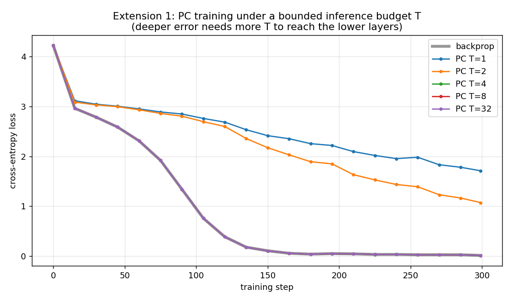

# Extension 1 — finite inference budget

**Question.** Every ladder result relaxed inference to convergence. That is
expensive and biologically implausible. If we cap inference at `T` steps, does PC
still train an attention stack?

**Setup.** A 3-layer causal char-LM (residual stack, softmax-CE head) trained with
backprop and with PC at `T ∈ {1, 2, 4, 8, 32}`, from the same init on the same
data. Code: [`run.py`](run.py); model + finite-budget PC in
[`../../pc_attention/deep_char_lm.py`](../../pc_attention/deep_char_lm.py).

**Why depth matters here.** In fixed-prediction PC the output error travels ~one
layer per inference step. With a shallow model (M3, one layer) any `T ≥ 1`
suffices, so the budget is invisible. With depth `L`, a budget `T < L` leaves the
lower layers with a stale/zero error signal — the gradient the layer receives is
simply wrong. The gate in `run.py` shows the per-batch gradient converging to
backprop as `T` grows (and needing larger `T` for larger `L`).

**Result.**



```
per-batch gradient error vs backprop:  T=1 0.31   T=4 0.28   T=8 0.17   T=32 3.6e-4   T=200 8e-13
final training loss (L=3):  backprop 0.0154 | PC T=1 1.71  T=2 1.07  T=4 0.0154  T=8 0.0154  T=32 0.0154
```

Two things worth noting:

1. **The budget must scale with depth, but only ~linearly.** For `L=3`, `T=1` and
   `T=2` never learn (loss stuck at 1.7 / 1.1) because the bottom layer's gradient
   is still wrong; from `T=4` on (`T ≳ L`) PC matches backprop's curve exactly. So
   converged inference is *not* required — a budget of order the depth is enough.

2. **Training is far more forgiving than the per-step gradient.** At `T=4` the
   per-batch gradient still differs from backprop by 0.28 (cosine-scale), yet the
   run reaches the same final loss (0.0154). Adam plus many steps averages the
   inference error away; you don't need an accurate gradient every step, just a
   roughly-right one for the layers that matter.

**Takeaway.** "PC = backprop at convergence" upgrades to "PC = backprop with an
inference budget ~ depth," and even that is loose — the LM trains fine well before
the gradient is accurate. The biologically-implausible part (unbounded relaxation)
turns out not to be needed.
