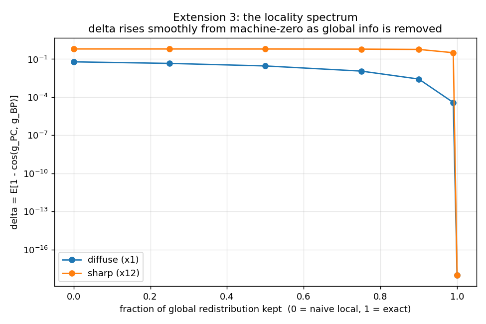

# Extension 3 — theory consolidation + the locality spectrum

[`THEORY.md`](THEORY.md) states the project's results as five clean claims (Path B,
Path A, depth, causal, and the cost of *less* locality) with pointers to the
proofs and gates, plus a spectrum table: backprop (whole forward pass) → Path B
(2 shared states) → Path A (1 scalar) → naive (0, and wrong).

[`run.py`](run.py) makes the last step continuous. It sweeps `alpha`, the fraction
of the softmax redistribution term the local rule keeps (0 = naive, 1 = exact),
and measures `delta`:



```
alpha        0.0    0.25    0.5    0.75    0.9    0.99    1.0
diffuse    0.060   0.045  0.029  0.011  0.003  3.8e-5   ~0
sharp      0.621   0.620  0.616  0.605  0.573  0.315    ~0
```

`delta` drops to machine-zero only at `alpha = 1` (keep everything). For **sharp**
attention it stays ~0.2 until the last few percent, then falls off a cliff — the
global redistribution is almost all-or-nothing. For **diffuse** attention it
declines gradually. Either way there is no cheap partial locality that recovers
backprop: you pay the full one-scalar (Path A) / two-state (Path B) price, or you
lose exactness.
